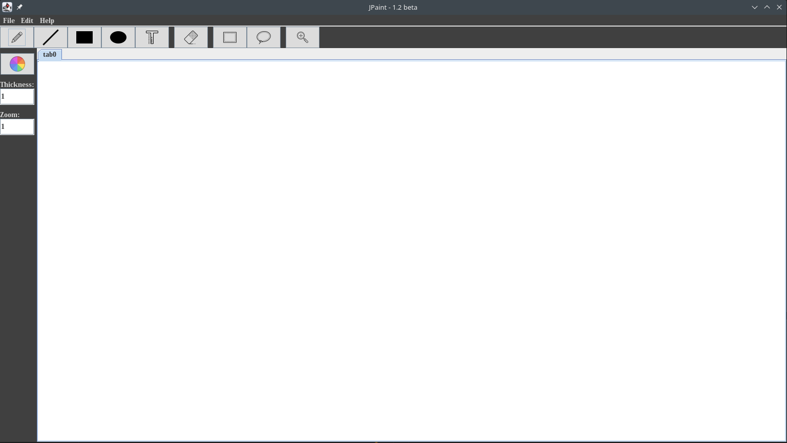
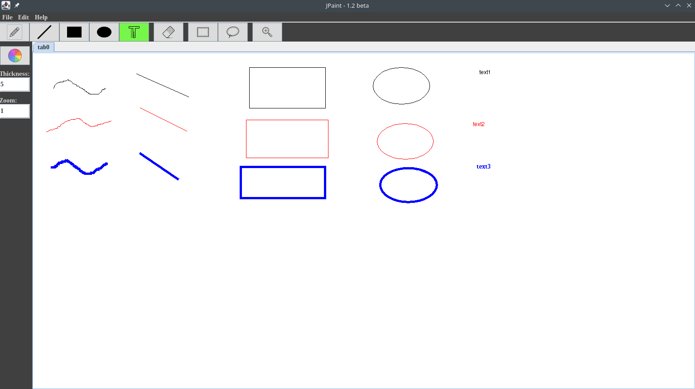

# JPaint
## _(not)Real paint for real geeks_
Just experimenting with the swing library

## Tools
- Pencil
- Line 
- Rectangle 
- Ellipse
- Text
- Rubber 
- Zoom

## Tool options
- Color
- Thickness
- Zoom level

## Screenshots

## ToDo
- Scroll pane 
- Tests
- Detailed documentation 
- Other Tools
- Choosing font for the text
- Add some Shortcuts 
- Tabs naming 
- Dragging fragments
- Undo/redo

## Issues
- Sometimes the workspace crawls to the left while drawing
